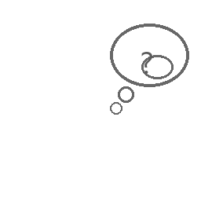

# toybox

 [](https://github.com/aberson/toybox/actions/workflows/linux-tests.yml) [](https://github.com/aberson/toybox/actions/workflows/frontend-tests.yml)    

A local-first home AI that watches for play opportunities, suggests structured activities to a parent, and runs the approved ones on a child kiosk featuring AI personas.

The mic listens passively. A trigger NLP and Claude (when available) propose activity scripts on the parent's tab. Only what the parent taps **Approve** appears on the child's iPad — installed as a PWA, locked to one app via Guided Access, no app store, no cloud account. The activity loop is built on 1,361 branching templates across `request_play`, `request_story`, `request_activity`, and `boredom` slot-fills, with songs, jokes, and 118-element periodic-table microgames as per-activity rewards.

**Two complementary surfaces:**

- **Parent app** (`/parent`): two-level tab shell. Mic-hot indicator, listening transcripts with retention sweep, suggestion queue, persona/toy/room/child management, banned themes, image-gen mode, household settings.
- **Child kiosk** (`/child`): full-bleed PWA. Persona avatar reacts; step cards advance; toy-action sprites overlay on the active toy; branching choice buttons; song/joke reward step.

Both share types, ws envelopes, and the same FastAPI backend — one async process, one SQLite file, one mic.

<table>
<tr>
<td width="25%" valign="top" align="center">
<a href="src/toybox/personas/library/avatars/wizard.png"></a>
<br/><sub><b>Personas</b><br/>4 hand-illustrated AI characters the child picks at session start</sub>
</td>
<td width="25%" valign="top" align="center">
<a href="data/images/elements/h-1.png"></a>
<br/><sub><b>Element microgames</b><br/>118-element periodic-table corpus, sprite per element</sub>
</td>
<td width="25%" valign="top" align="center">
<a href="data/sprites/templates/thinking.png"></a>
<br/><sub><b>Toy action sprites</b><br/>10 action poses overlay on the active toy mid-activity</sub>
</td>
<td width="25%" valign="top" align="center">
<!-- TODO: capture parent UI or kiosk screenshot during a real run. See documentation/operator/screenshot-capture.md. -->

<br/><sub><b>iPad kiosk</b><br/>PWA over LAN, no app store (screenshot TODO)</sub>
</td>
</tr>
</table>

> **25 → 1,361 activity templates** across 14 phases shipped, fully on-device. Catalog grows by parent approvals → labeled events → SFT corpus, waiting on ≥50 rows before LoRA fine-tune kicks in (Phase E).
>
> **iPad UAT 11/12 PASS** at Phase M close (2026-05-18) — kiosk runs as a Guided Access app on a real iPad over Wi-Fi LAN. **2,325 pytest + 741 vitest** green at the SWR Opus re-review close (2026-06-17). Fully offline once whisper-small + persona avatars + element sprites are cached locally.

## What makes this different

Most "home AI" devices stream audio off-box, route through a vendor account, or stand in for the parent. This one doesn't:

- **Local-first by default.** Mic capture, silero-VAD, faster-whisper, trigger NLP, persona library, activity generator — all run on one home machine. Internet is only used for Claude calls over the user's subscription OAuth (no API key) and first-run model downloads.
- **Parent approves every activity before the kiosk shows it.** The mic listens passively; the activity generator surfaces suggestions on the parent's tab; nothing appears on the child surface until the parent taps **Approve**. PIN-gated LAN binding refuses non-loopback host until a parent PIN is set.
- **No app store, no cloud account, no installer.** Child kiosk is a PWA installed via Safari → Add to Home Screen → Guided Access. The home machine binds `0.0.0.0` with `TOYBOX_LAN_IP` set and the iPad connects directly over Wi-Fi.
- **Capability-gated.** Every Claude call goes through a capability gate so a network outage degrades to a fully-offline curated activity generator with no behavior change for the child.

The architecture is family-agnostic — the test case happens to be two real kids (a 6-year-old early-reader and a 4-year-old Periodic-Table-fascinated pre-reader), which is why elements and SEL templates are both load-bearing in the catalog.

**Deep dives:** [Architecture](documentation/plan/architecture.md) · [Data model](documentation/plan/data-model.md) · [API](documentation/plan/api.md) · [Activity loop](documentation/plan/activity-loop.md) · [Runtime](documentation/plan/runtime.md) · [Risks](documentation/plan/risks.md)

---

## The activity loop

```
        ┌──────────────────────────────────────────────────────────┐
        │                   the activity loop                      │
        │                                                          │
        │   ┌─────────┐    ┌─────────┐    ┌─────────┐    ┌───────┐ │
        │   │         │    │         │    │         │    │       │ │
        │   │  HEAR   │───►│ TRIGGER │───►│ PROPOSE │───►│PARENT │ │
        │   │         │    │         │    │         │    │APPROVE│ │
        │   └─────────┘    └─────────┘    └─────────┘    └───┬───┘ │
        │    silero VAD     NLP registry   1,361-template    │     │
        │    + faster-      + Claude       branching         │     │
        │      whisper      escalation     catalog +         │     │
        │      small        (offline OK)   persona slot      │     │
        │                                                    ▼     │
        │   ┌─────────┐    ┌─────────┐    ┌─────────┐    ┌───────┐ │
        │   │  HOME   │◄───│ REWARD  │◄───│   RUN   │◄───│ KIOSK │ │
        │   │  ROOM   │    │         │    │         │    │  PWA  │ │
        │   └─────────┘    └─────────┘    └─────────┘    └───────┘ │
        │    kids play      song/joke      step cards     persona  │
        │    + chatter      reward step    + sprite       avatar   │
        │    feeds back     advances on    overlay        + iPad   │
        │    into HEAR      kiosk          on active      Guided   │
        │                                  toy            Access   │
        │                                                          │
        └──────────────────────────────────────────────────────────┘
```

The mic loop and the activity loop are deliberately the same loop. Chatter while an activity is running feeds back into the trigger NLP — saying "let's play unicorns" mid-activity surfaces a fresh suggestion on the parent's tab without interrupting what's already on the kiosk. The parent decides whether to queue, advance, or replace.

**Read the full pipeline:** [activity-loop.md](documentation/plan/activity-loop.md) · [runtime.md](documentation/plan/runtime.md)

---

## How activities are built

```
   plain-text intent ("let's play unicorns")
              │
              ▼
   ┌─────────────────────┐
   │  trigger NLP        │   curated regex registry, deterministic, offline
   │  + Claude escalate  │   Claude only on ambiguous phrases (rate-limited)
   └──────────┬──────────┘
              │  intent + slot hints
              ▼
   ┌─────────────────────┐
   │ branching template  │   1,361 templates × 4 intents
   │ catalog             │   (request_play / request_story / request_activity / boredom)
   └──────────┬──────────┘
              │  template + slot-fill
              ▼
   ┌─────────────────────┐
   │ content resolver    │   real toys, real rooms, real child profile
   │ + persona binding   │   per-toy allowed_roles, per-child banned_themes
   └──────────┬──────────┘
              │  resolved activity (steps + sprites + reward)
              ▼
   ┌─────────────────────┐
   │ parent suggestion   │   optimistic concurrency on activities
   │ queue + approval    │   If-Match-Version on every mutation
   └─────────────────────┘
```

Every activity has a slot for a persona (Wizard / Princess / Detective / Periodic-Table Professor, plus parent-grown ones), a theme (from a 12-theme corpus), and a reward type (song / joke / element microgame). The branching templates encode two binary forks per script and tag each fork with the persona role taxonomy + theme allowlist so the resolver can pick a script that respects per-toy and per-child constraints.

**Read the catalog mechanics:** [data-model.md](documentation/plan/data-model.md) · [phase-l-plan.md](documentation/plan/archive/phase-l-plan.md) (rewards as per-activity reward TYPES)

---

## What the child sees

```
                 ┌────────────────────────────────────┐
                 │  child kiosk (PWA, full-bleed)     │
                 │                                    │
                 │   ╔═══════════════════╗            │
                 │   ║                   ║            │
                 │   ║  persona avatar   ║   step 2 of 5
                 │   ║   (Wizard mode)   ║            │
                 │   ║                   ║            │
                 │   ╚═══════════════════╝            │
                 │                                    │
                 │   ┌──────────────────────────┐     │
                 │   │  "Wave at your toy!"     │     │
                 │   │   [waving sprite overlay │     │
                 │   │    on the toy in frame]  │     │
                 │   └──────────────────────────┘     │
                 │                                    │
                 │   ┌─────────────┐ ┌─────────────┐  │
                 │   │ I did it!   │ │ I'm stuck   │  │
                 │   └─────────────┘ └─────────────┘  │
                 │                                    │
                 └────────────────────────────────────┘
                          │
                          ▼
                 ┌────────────────────┐
                 │  reward step       │
                 │  (song or joke)    │
                 │   ♪ TTS-rendered   │
                 │     element song   │
                 └────────────────────┘
```

Persona avatar reacts to advance / branch / reward events via ws. Step cards advance forward only; "step back across a branch choice" was an emergent fix in Phase G UAT. The reward step renders before the activity transitions to `completed` — the two-phase terminal advance pattern from Phase L keeps `state=running` while the reward is on-screen, Phase 2 dismiss completes the activity.

**Read the kiosk wiring:** [api.md](documentation/plan/api.md) (ws envelopes + topics)

---

## Why not just have a smart speaker do it?

Smart speakers route audio off-device, tie the household to a vendor account, and replace the parent with a voice assistant. None of those are acceptable failure modes for a play device that lives in a family room with young children.

So toybox listens locally (silero-VAD + faster-whisper, no audio leaves the box), keeps Claude in an advisory role (rate-limited, capability-gated, opt-out by killing network), and gates every kiosk-visible action on a parent approval. The result is an assistant that helps a parent come up with structured play, not one that plays alongside the kid in the parent's absence.

---

# The Story So Far of toybox

- **Original motivation** — A passive home device that helps a parent improvise structured play with young children, with all audio + state on one home machine and no cloud account.
- **The closed loop (Phase A, 2026-05-02)** — Mic placeholder + listening state machine + persona library + offline activity generator + parent + child UI wired end-to-end. The skeleton works; v1 ships.
- **Actually hearing the room (Phase B)** — silero-VAD + faster-whisper-small replace the placeholder; mode-aware Claude escalation routes short triggers through the NLP registry and only the ambiguous phrases through Claude.
- **Real content + ingest (Phase C–D)** — Toys, rooms, child profiles editable in the parent app; anti-signal feedback so bad suggestions get downweighted; parent PIN gates LAN binding.
- **iPad kiosk (2026-05-04 → 2026-05-10)** — Child surface as a real PWA on a real iPad over LAN, installed via Safari → Add to Home Screen → Guided Access. No app store.
- **Toy action sprites (Phase F → F.5)** — SD 1.5 + LCM-LoRA + Tier C composite generates per-toy action sprites locally. F shipped with a c10.dll crash class ([#61](https://github.com/aberson/toybox/issues/61)) → archived; F.5 replaced it cleanly.
- **Branching gameplay (Phase G, 2026-05-10)** — Overnight 4-agent soak grew the template catalog **25 → 225** with 0% validation failures.
- **Parent UX revamp (Phase H, 2026-05-10)** — Panel-toggle nav → two-level tab shell; per-child columns promoted to global household settings.
- **Transcript management (Phase I, 2026-05-11)** — Household-scoped retention preset, 10s-cadence sweep, fade-out animation on the display.
- **Autonomous play queue (Phase J, 2026-05-14)** — Parent's Play surface becomes an autonomously-fed scrolling queue; tunable cadence + queue depth.
- **Roles + songs + jokes + voice (Phase K, 2026-05-15 → 2026-05-16)** — 10-role taxonomy, 12-theme corpus, 75-song TTS render, song/joke rewards. Catalog **225 → 1,000** templates.
- **Rewards system (Phase L, 2026-05-17)** — Jokes/songs reframed as per-activity reward TYPES; embedded/ending/spontaneity interjection surfaces deleted in favor of set-intersection tag matching. Two-phase terminal advance pattern shipped.
- **Content depth (Phase M, 2026-05-18)** — Periodic-Table-Professor expansion (118 elements + sprites + microgames + 25 element-themed songs) + SEL templates (feelings-naming + perspective-taking + conflict-resolution + friendship-repair). Catalog **1,000 → 1,243**. iPad UAT 11/12 PASS.
- **UX refinements (Phase R, 2026-06-05)** — Cadence loop removed; TriggerButton promoted to prominent CTA; spoken text character limit (parent-configurable, word-boundary truncation); Q&A gating on activity steps (approve-question endpoint + WS push to child kiosk); activity search (GET /api/search, template pinning via ProposeRequest.template_id). **2,288 pytest + 682 vitest** passing.
- **Kiosk visual refresh (Phase S, 2026-06-05)** — Persona-keyed background gradients (detective/princess/wizard/periodic_table/null each get a distinct CSS gradient); step card more prominent (larger font, stronger shadow, dark border); Claude assigns one avatar animation per step at approve-time (`animator.py`, sync urllib call, `SyncAIClient` Protocol); `PersonaAvatar` plays the matching infinite CSS animation (`float/pulse/wobble/jump/shine/spin`) for the duration of each step. **2,298 pytest + 709 vitest** passing.
- **In flight: Phase E** — Local model fine-tune via LoRA. Backend substrate already shipped in two carve-outs ([Step 28](https://github.com/aberson/toybox/issues), [Step 27 / E3 at `4f735a0`](https://github.com/aberson/toybox/commit/4f735a0)). Full ship gated on ≥50 SFT-filter rows in `labeled_events` — populated naturally as parents tag activities.

---

<details>

<summary><b>Stack</b></summary>

| Layer | Tool | Why |
|---|---|---|
| Backend | Python 3.12 + FastAPI | async-native, ws built-in |
| ASR | faster-whisper (`small`) | local STT; GPU when available, CPU fallback |
| VAD | silero-vad (ONNX) | gates STT on detected speech only |
| AI | Claude (subscription OAuth) | capability-gated; offline mode supported |
| Curated NLP | Python regex + intent registry | fast, deterministic, offline-capable |
| Image-gen | SD 1.5 + LCM-LoRA + Pillow overlay | per-toy action sprites + element sprites, locally |
| TTS | Coqui XTTS-v2 (CPU/GPU) | song + joke reward rendering, locally |
| DB | SQLite (WAL mode) | local, file-based, single-writer |
| Mic capture | sounddevice | callback-based, bridged to asyncio |
| Frontend | React + TypeScript + Vite | one project, two routes (`/parent`, `/child`) |
| Real-time | WebSockets (FastAPI) | parent ↔ backend ↔ child |
| Type sync | pydantic-to-typescript | TS types codegen from Pydantic models |
| Tests | pytest + vitest + Playwright | unit + integration + UI smoke |
| Lint/format | ruff (line-length=100) | dev/ standard |
| Type check | mypy strict | dev/ standard |
| Package mgmt | uv (Python) + npm (frontend) | dev/ standard |

**Process model:** single uvicorn worker. SQLite + multi-worker leads to silent corruption under contention; mic capture, AI calls, image-gen worker, TTS render, and ws all live in one async process.

</details>

<details>

<summary><b>Prerequisites</b></summary>

| Component | Minimum |
|---|---|
| OS | Windows 11 (primary), macOS 13+, Linux (Ubuntu 22.04+) |
| RAM | 8 GB |
| Disk | 5 GB free (incl. ~500 MB whisper-small download + ~2 GB SD 1.5 + LoRAs) |
| CPU | 4 cores ≥3.0 GHz |
| GPU | not required; `auto`-detected. CUDA path needs CUDA Toolkit 11.8/12.x **and** cuDNN 8.x |
| Mic | any 16 kHz mono-capable USB or built-in mic |
| iPad | any iPad on the same Wi-Fi as the home machine (kiosk runs as PWA) |
| Network | required first-run only (model downloads + Claude OAuth) |

</details>

<details>

<summary><b>Setup</b></summary>

```powershell
# Python deps
uv sync

# Frontend deps
cd frontend; npm install
npx playwright install
cd ..

# Initialize DB (applies migrations, copies trigger registry, copies persona avatars)
uv run python -m toybox.db.migrate

# Pre-download whisper + VAD models (optional; lazy on first use otherwise)
uv run python -m toybox.audio.stt --download

# Set up Claude OAuth (see documentation/operator/claude-oauth-setup.md)
# Token written to %USERPROFILE%\.toybox\secrets.json on Windows

# Verify
uv run python -m toybox.main --check
```

</details>

<details>

<summary><b>Run dev</b></summary>

```powershell
# Terminal 1 — backend (loopback only by default; LAN binding requires parent PIN)
uv run python -m toybox.main --host 127.0.0.1 --port 8000

# Terminal 2 — frontend
cd frontend; npm run dev

# Open http://localhost:4000/parent
```

Vite pins `server.port: 4000, strictPort: true` and proxies `/api` + `/ws` to the backend at `:8000`. The dev port is `:4000`, not the typical `:3000`.

</details>

<details>

<summary><b>Run on iPad (kiosk)</b></summary>

The child kiosk runs on a real iPad over the home Wi-Fi LAN — no proxy, no cloud, no app-store install. Full procedure with troubleshooting is in [documentation/operator/ipad-setup.md](documentation/operator/ipad-setup.md). Quick path:

**Prereqs (on the home machine):**

- Parent PIN is set (LAN binding is gated on this — confirm via `GET /api/auth/parent/status`).
- Find the home machine's LAN IP (`ipconfig`, IPv4 under the Wi-Fi adapter — not Ethernet, not Hyper-V/Docker/WSL virtual switches).
- **Set `TOYBOX_LAN_IP` and bind backend to `0.0.0.0` in the same shell** — without this env var the backend's WS Origin allow-list is loopback-only and the iPad's WS handshake will be rejected with HTTP 403:

  ```powershell
  $env:TOYBOX_LAN_IP = "192.168.x.x"   # your LAN IP from ipconfig
  uv run python -m toybox.main --host 0.0.0.0 --port 8000
  ```

- Frontend dev server bound to `0.0.0.0`:

  ```powershell
  cd frontend; npm run dev -- --host 0.0.0.0
  ```

- iPad is on the **same Wi-Fi SSID** as the home machine. Guest networks, AP-isolated SSIDs, and corporate networks that block client-to-client traffic do **not** work.

**On the iPad:**

1. Open Safari → navigate to `http://<lan-ip>:4000/child`.
2. Enter the parent PIN once. This confirms LAN reachability and primes iOS audio unlock.
3. Share button → **Add to Home Screen** → name it `toybox` → Add.
4. (Recommended) Lock the kiosk to a single app: Settings → Accessibility → Guided Access → toggle On + set a passcode. Open the home-screen icon, then triple-click the side button to start Guided Access. Triple-click + passcode to exit.

**Dev iteration tip:** desktop Safari → Develop → Enter Responsive Design Mode → pick an iPad preset. Catches viewport / orientation / touch issues without a real iPad in front of you. Audio unlock and Guided Access do require the real device.

</details>

<details>

<summary><b>Quality gates</b></summary>

```powershell
uv run ruff check .
uv run ruff format --check .
uv run mypy src
uv run pytest

cd frontend
npm run typecheck
npm run lint
npm run test
```

Backend `2,288 pytest pass / 6 skipped`, frontend `682 vitest pass`, 0 type errors, 0 lint violations at Phase R close (master `a84de0a`, 2026-06-05). Phase M smoke gate (`tests/integration/test_phase_m_smoke.py`) runs the full propose → approve → advance → reward path through real corpora and real DB in 1.65s — no mocks.

</details>

<details>

<summary><b>Key design decisions</b></summary>

- **Local-first, family-private.** All state stays on one home machine. Internet optional after first-run model downloads.
- **Single FastAPI process for everything.** Mic capture, STT, NLP, AI calls, image-gen worker, TTS render, REST, ws — all one async process. Trade-off: a slow Claude call could starve the mic loop. Mitigated with `asyncio.to_thread` + circuit breaker.
- **Claude via OAuth, not API key.** Aligns billing with the user's subscription; capability gate falls back to offline cleanly.
- **Branching templates, not free-form generation, for v1+.** 1,361-template catalog with persona-role + theme + reward-type tagging. Free-form Claude generation is reserved for ambiguous-trigger escalation, never for kiosk-visible activity bodies.
- **Single Vite project, two routes.** Parent and child share types and rendering primitives; child loads the smaller chunk.
- **Single-worker SQLite + WAL.** Multi-worker silently corrupts; one worker is fine for a household device.
- **Optimistic concurrency on activities.** `If-Match-Version` on every mutation; multi-tab races resolve cleanly with 409.
- **Default bind 127.0.0.1.** LAN binding requires a parent PIN; startup guard refuses non-loopback host without one (a startup invariant, not a documented convention).
- **Mic-hot indicator as a first-class UI element.** Constant-on visual signal that mic capture is live, visible from across the room.

Full design rationale, schema, and listening-pipeline data flow live in [documentation/master-plan.md](documentation/master-plan.md) and the per-topic deep dives under [documentation/plan/](documentation/plan/).

</details>

<details>

<summary><b>Project structure</b></summary>

```
toybox/
├── documentation/
│   ├── master-plan.md                # canonical plan + status (only plan in root)
│   ├── plan/                         # reference sub-docs + active phase plans (phase-e/w/x)
│   ├── plan/awaiting-uat/            # code-shipped, operator UAT still open (O,P,Q,R,S,T,V)
│   ├── plan/archive/                 # completed / superseded phase plans
│   ├── operator/                     # iPad setup + Claude OAuth setup + recovery runbooks
│   └── runs/                         # phase verification artifacts (UAT pass docs, soak runs)
├── src/toybox/
│   ├── api/                          # FastAPI routes + ws (activities, auth, transcripts, children, toys, rooms, …)
│   ├── core/                         # state machines, errors, capability gate, escalation, throttle
│   ├── ai/                           # Claude OAuth client + circuit breaker + PII redactor
│   ├── audio/                        # sounddevice capture + silero-VAD + faster-whisper STT
│   ├── activities/                   # generator + content resolver + slot resolver + branching templates
│   ├── activities/templates/branching/   # 1,361-template catalog (~340 per intent)
│   ├── image_gen/                    # SD 1.5 + LCM-LoRA worker + Pillow text overlay
│   ├── personas/library/             # persona library + avatars (Wizard, Princess, Detective, Periodic-Table)
│   ├── triggers/                     # curated NLP registry
│   ├── db/migrations/                # forward-only SQL migrations (0001 → 0023+)
│   └── ws/                           # ws server + heartbeat + envelope + topics
├── frontend/
│   ├── src/parent/                   # parent route (App + api + ws + store + components)
│   ├── src/child/                    # child kiosk route (App + api + ws + store + sfx + components)
│   ├── src/shared/                   # types.ts + errors.ts (codegen from Pydantic)
│   ├── public/sfx/                   # SFX assets
│   └── playwright/                   # e2e smoke specs (parent.spec.ts + child.spec.ts)
├── data/                             # runtime: db, models, images, sprites (gitignored except canonical sprites)
├── tests/                            # pytest unit + integration + integration/smoke gates
└── .github/workflows/                # linux-tests.yml + frontend-tests.yml
```

</details>

<details>

<summary><b>Development process</b></summary>

`/build-phase --plan documentation/<phase>-plan.md` per phase. Steps within a phase use `/build-step` (or `/build-step-tdd` for schema/CRUD work). The full skill pipeline lives in `dev/CLAUDE.md`: `/plan-init` or `/plan-feature` → `/plan-review` → `/plan-wrap` → `/repo-init` or `/repo-sync` → `/build-phase` → `/repo-update`.

Phase plans live at `documentation/<name>-plan.md`. Each plan step has an `**Issue:** #N` link to a GitHub issue; build-phase walks the plan in order and dispatches `/build-step` per step. UAT happens via bundled iPad sessions at phase close (operator-step format documented in [`dev/.claude/rules/plan-and-issue-flow.md`](../dev/.claude/rules/plan-and-issue-flow.md) §"Operator-type steps must not produce code artifacts").

</details>

<details>

<summary><b>Phase status (full audit trail)</b></summary>

**Phase M COMPLETE 2026-05-18 at master `a096e11`.** All 14 step issues closed (#153–#166) + umbrella [#152](https://github.com/aberson/toybox/issues/152) closed. M2b sprite render + M7b TTS render + M14 iPad UAT all shipped in the operator session. **UAT verdict: 11/12 PASS, 1 DEFERRED** (row #4 `shrink_into_helium_balloon_voyage` blocked by defect D2 — re-test scheduled in Phase N N6 [#176](https://github.com/aberson/toybox/issues/176) once N0 [#168](https://github.com/aberson/toybox/issues/168) ships). Exceeds 10/12 quality bar. UAT run-doc: [`documentation/runs/2026-05-18-phase-m-uat.md`](documentation/runs/2026-05-18-phase-m-uat.md).

**Phase M UAT surfaced 3 defects + 1 feature request — folded into 2 follow-up phases (14 issues minted at /repo-sync):**

- **Phase N** (umbrella [#167](https://github.com/aberson/toybox/issues/167), 9 steps [#168–#176](https://github.com/aberson/toybox/issues/167)) — `element_microgame` template shape, bundled with D1 + D2 fixes.
- **Phase O** (umbrella [#177](https://github.com/aberson/toybox/issues/177), 3 steps [#178–#180](https://github.com/aberson/toybox/issues/177)) — parent UX 5-tab refresh.
- **Phase P** (umbrella [#182](https://github.com/aberson/toybox/issues/182), 9 steps [#183–#191](https://github.com/aberson/toybox/issues/182)) — toy image-gen quality redo via IP-Adapter Plus on SD 1.5.
- **Phase Q** (umbrella [#195](https://github.com/aberson/toybox/issues/195), 11 steps [#196–#206](https://github.com/aberson/toybox/issues/195)) — 1:1 element-id → reward mapping.

Phase N parallel-safe block (N0 + N0b + N1-prep + N3) shipped 2026-05-18 at master `555246b`; pytest 2044 (+60) + vitest 601 (+3). Remaining: N1.5 / N1 / N2 / N4 / N5 / N6.

**Phase R COMPLETE 2026-06-05 at master `a84de0a`.** All 4 code steps shipped (#212–#215); umbrella [#211](https://github.com/aberson/toybox/issues/211). R5 iPad UAT (#216) bundled with Phase S UAT. Key deliverables: cadence loop + proposed_ttl removed (play_cadence.py + 3 modules deleted); TriggerButton full-width CTA; spoken text limit (migration 0022, word-boundary truncation in ReadMeButton); Q&A gating on activity steps (migration 0023, POST /approve-question, WS emit); GET /api/search with LIKE scan + template registry + ProposeRequest.template_id pinning. **2,288 pytest + 682 vitest** passing.

</details>

---

## License

MIT — see [LICENSE](LICENSE). Family-private project; the code is MIT but no warranty, support, or fitness-for-redistribution claim is made.

---

## Acknowledgments

- Built alongside two kids who actually play with it.
- Personas illustrated by hand; element sprites composited from Stable Diffusion 1.5 + LCM-LoRA + Pillow text overlay.
- Songs voiced via Coqui XTTS-v2.
